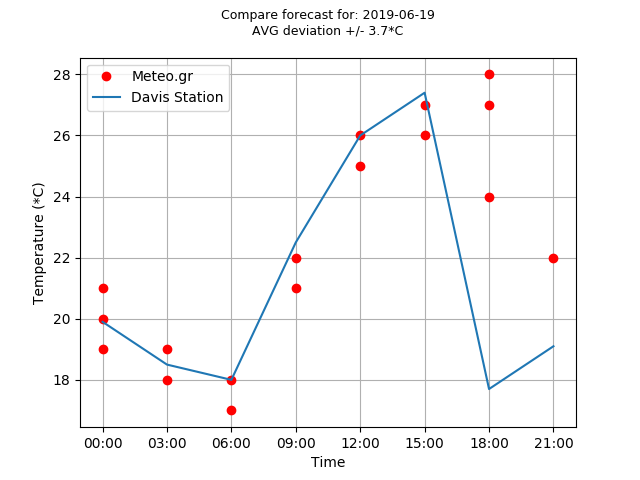

<h2>Validate meteo.gr forecasts</h2>

<p>
	Sometimes you don't know which weather site to trust. With this script you can calculate how accurate is a site, at this script I use meteo.gr <br>
	The python script, downloads meteorological data from the meteo.gr and a Davis Weather station wich is placed in the city I would like to know the forecast. After that it will present the percent of success the meteo site had. 
</p>

<p>
	The meteo.gr dosn't provide any API so for the data download is used the <a href="https://www.crummy.com/software/BeautifulSoup/bs4/doc/">Beautiful Soup</a> lib. <br>
	Do not trust this script for long term data collection because it is based on web scraping technique. If any of the sites, in the future, change their structure the data collection will fail.  
</p>


<p>
	Sometimes meteo.gr gives multiple forecasts for the same hour. You can plot all the forecast by givint the True argument to db_object.select_meteo(date, True)
</p>




<hr>

<h3>Installation and use</h3>
<p>
	In order to use the script, you have to use python3 and install the requirements. Some info about data download is saved to a file called info.log
</p>

```shell
pip3 install -r requirements.txt
```

<p>
	After installing the requirements run the script as a typical python3:
</p>

```shell
python3 src/main.py
```

<p>
	Assign the task to a cron job every 3 hours. (meteo.gr has forecast every 3 hours) <br>
	In order to check the collected data use the show_plots.py script. Give a date as an argument for older days. No date argument shows today forecast.
</p>

```shell
python3 show_plots.py 2019-06-18
```


<p>
	If you want to export the plot to an image file add an extra argument, for example 'save'
</p>

```shell
python3 show_plots.py 2019-06-18 save
```


<p>
	db_instance.select_meteo(date, True or False)  Seting this to false you will get only the last forecast. (One dot)
</p>

```shell
db.select_meteo(date, True)
```

TODO and Bugs:
<ol>
	<li>Fix data collection for negative temperatures</li>
	<li>Year to meteo table</li>
	<li>On station db convert collected date to better format</li>
	<li>Optimize code</li>
</ol>
